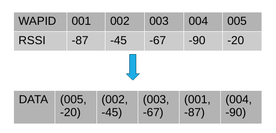
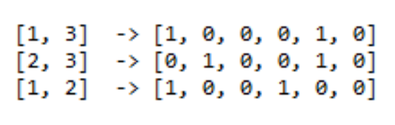
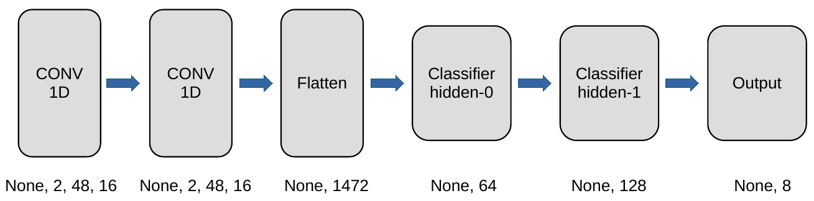
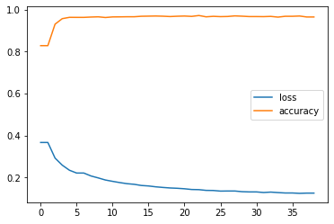
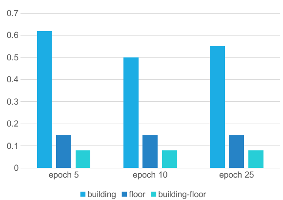
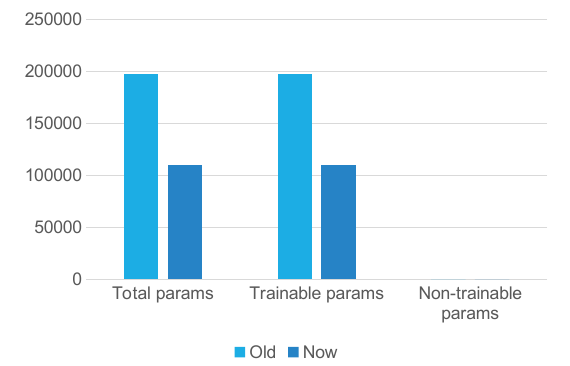
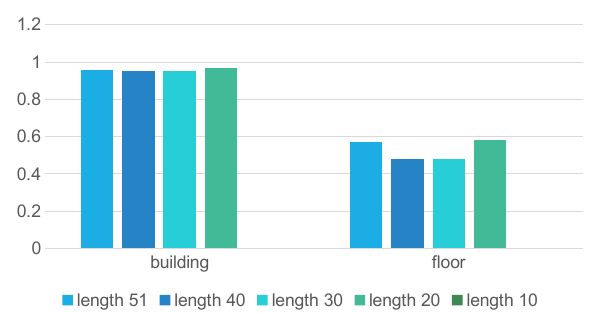

# Scalable Representation of RSSIs for Multi-Building and Multi-Floor Indoor Localization Based on Deep Neural Networks

## Abstract

For large-scale multi-building and multi-layer indoor localization based on a single dataset of Wi-Fi received signal strength (RSS), we propose a scalable representation of neural network input data that reduces the number of hyperparameters, which makes battery-powered mobile devices and embedded systems as a target platform. Based on the UJIIndoorLoc dataset, we use an RSSI-based ranking and truncation method to reduce the input data dimensionality and use a convolutional neural network (CNN) to build a multi-label indoor localization model. We also study the relationship between localization accuracy and the number of input signals and verified that the smaller input dimension has limited effect on the model accuracy.

## Backgrounds

* Statistics of the RSSIs in UJIIndoorLoc database

    * Only few APs are detected at a given reference point among the campus-wide 520 APs.

        * This is a typical characteristic of multi-building and multi-floor Wi-Fi RSSI datasets unlike those of large-scale but open-space structures like arenas, auditoriums, and halls where there are no hierarchical structures.

    * There are even reference points without any RSSI, which could cause issues during the prediction.

        * They should be removed during the preprocessing.

    * Inconsistencies in RSSI reported by different HWs (e.g., Samsung vs Xiaomi) and OSs (e.g., Android
vs iOS) in different units and scales.

* Possible scalable representation of RSSIs

    * Based on stacked autoencoders (SAEs).

        * Depends on the statistics of a training set.

    * Based on ordering of RSSIs.

        * Note that sorting numbers is one of the hardest tasks for artificial neural networks.

        * Further truncation based on RSSI values (e.g., K-strongest selection).

        * Percentage of total energy (e.g., 90% of total energy; similar to FM).

        * Threshold (e.g., discard RSSIs less than -90)

## Research questions

* How can we represent in a scalable way large-dimensional RSSIs (e.g., 520-dimensional vectors in the UJIIndoorLoc database) as inputs to a DNN model for multi-building and multi-floor indoor localization?

* What are the best DNN architectures for scalable representation of RSSIs (e.g., time series representation)?

## Objective 

* Preprocessing the UGIIndoorLoc dataset using sorting and truncation

* Predict indoor locations using a Convolutional Neural Network (CNN)

* Investigate the impact of smaller dimensional input data on model accuracy

## Methodology

### 1. Sorting and Truncation

Remove the inefficient data, replace the header with the list index.

### 2. Multi-label one-hot encoding

One hot encoding makes the training data more useful and expressive, and it can be rescaled easily.

### 3. Working Principle of CNN

CNN is very effective in image recognition, the processed data is treated as a 1D 2 channel image for training.

### 4. Re-identify prediction output

Re-identify the one-hot data generated by the prediction as building and floor ID.

## Result

### 1. loss VS accuracy

### 2.  Accuracy rate of different backpropagation times

### 3. Number of Parameters (DNN VS CNN)

Compared to the original DNN, the CNN reduces the number of parameters by about half.

### 4. Reduce the input data (Number of signals VS Accuracy)

By reducing the number of input signals from 51 to 10, It can be found that smaller inputs have little effect on model accuracy.

## Outcomes

### Github repository

[juntong20XX](https://github.com/juntong20XX/CNN-Indoor-Localization)

[myaki-moe](https://github.com/myaki-moe/CNN-Indoor-Localization)

### Publications

TBD

## References

1. Alejandro Pasos Ruiz, Michael Flynn, James Large, Matthew Middlehurst, and Anthony Bagnall, "The great multivariate time series classification bake off: a review and experimental evaluation of recent algorithmic advances," Data Mining and Knowledge Discussions, vol. 35, no. 2, pp. 401-449, Mar. 2021.
2. Hassan Ismail Fawaz, Germain Forestier, Jonathan Weber, Lhassane Idoumghar, and Pierre-Alain Muller, "Deep learning for time series classification: A review," Data Mining and Knowledge Discovery, vol. 33, no. 4, pp. 917-963, Mar. 2019.
3. Zhe Tang, Sihao Li, Kyeong Soo Kim, and Jeremy Smith, "Multi-output Gaussian process-based data augmentation for multi-building and multi-floor indoor localization," accepted for presentation at IEEE Fourth International Workshop on Data Driven Intelligence for Networks and Systems (DDINS) (organized in conjunction with IEEE ICC 2022), Mar. 7, 2022.
4. Abdalla Elesawi and Kyeong Soo Kim, "Hierarchical multi-building and multi-floor indoor localization based on recurrent neural networks," Proc. 2021 Ninth International Symposium on Computing and Networking Workshops (CANDARW 2021), Matsue, Japan, pp. 193-196, Nov. 23-26, 2021.
5. Jaehoon Cha, Kyeong Soo Kim, and Sanghyuk Lee, "Hierarchical auxiliary learning," Machine Learning: Science and Technology, vol. 1, no. 4, pp. 1-11, Sep. 11, 2020.
6. Zhenghang Zhong, Zhe Tang, Xiangxing Li, Tiancheng Yuan, Yang Yang, Wei Meng, Yuanyuan Zhang, Renzhi Sheng, Naomi Grant, Chongfeng Ling, Xintao Huan, Kyeong Soo Kim and Sanghyuk Lee, "XJTLUIndoorLoc: A new fingerprinting database for indoor localization and trajectory estimation based on Wi-Fi RSS and geomagnetic field," Proc. 2018 CANDAR, Takayama, Japan, Nov. 27-30, 2018.
7. Kyeong Soo Kim, "Hybrid building/floor classification and location coordinates regression using a single-input and multi-output deep neural network for large-scale indoor localization based on Wi-Fi fingerprinting," Proc. 2018 CANDAR, Takayama, Japan, Nov. 27-30, 2018.
8. Jaehoon Cha, Sanghyuk Lee, and Kyeong Soo Kim, "Automatic building and floor classification using two consecutive multi-layer perceptron," Proc. ICCAS 2018, Pyeongchang, Korea, Oct. 2018.
9. Kyeong Soo Kim, Sanghyuk Lee, and Kaizhu Huang "A scalable deep neural network architecture for multi-building and multi-floor indoor localization based on Wi-Fi fingerprinting," Big Data Analytics, vol. 3, no. 4, pp. 1–17, Apr. 2018.
10. Kyeong Soo Kim, Ruihao Wang, Zhenghang Zhong, Zikun Tan, Haowei Song, Jaehoon Cha, and Sanghyuk Lee, "Large-scale location-aware services in access: Hierarchical building/floor classification and location estimation using Wi-Fi fingerprinting based on deep neural networks," (Extended version of the FOAN 2017 paper) Fiber and Integrated Optics, vol. 37, no. 5, pp. 277–289, Apr. 10, 2018.
11. Kyeong Soo Kim, Ruihao Wang, Zhenghang Zhong, Zikun Tan, Haowei Song, Jaehoon Cha, and Sanghyuk Lee, "Large-scale location-aware services in access: Hierarchical building/floor classification and location estimation using Wi-Fi fingerprinting based on deep neural networks," Proc. FOAN 2017, Munich, Germany, Nov. 7, 2017.
12. J. Torres-Sospedra et al., "UJIIndoorLoc: A new multi-building and multi-floor database for WLAN fingerprint-based indoor localization problems," Proc. International Conference on Indoor Positioning and Indoor Navigation (IPIN), Busan, Korea, Oct. 2014, pp. 261–270.
13. P. Bahl and V. N. Padmanabhan, "RADAR: An in-building RF-based user location and tracking system," Proc. 2000 IEEE INFOCOM, vol. 2, 2000, pp. 775–784.
